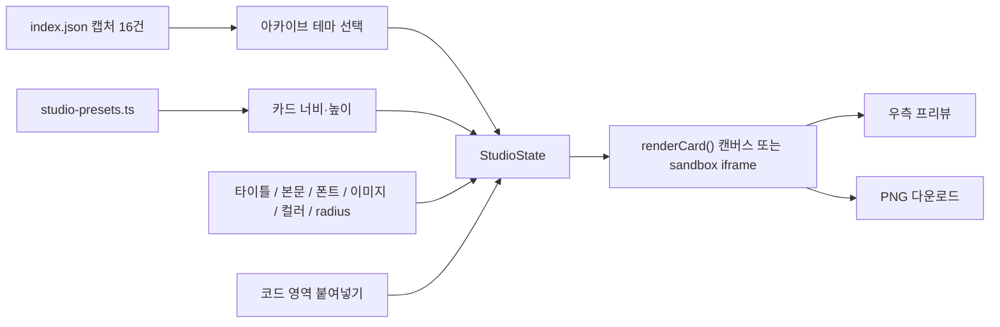

# Phase 1 — Online Marketing Studio

목표: Archive에 쌓인 16개 디자인 작업물을 테마로 골라, 인스타그램·페이스북·유튜브 커버·쇼츠 같은 **온라인 마케팅 브랜드 에셋**을 만들고 PNG로 다운로드하는 툴을 만든다.

참조 결정: `D-01`, `D-03`, `D-04`, `D-11`, `D-12`, `D-14` / 기반: [Phase 0 Archive Foundation](phase-0-foundation.md)

> 상태: **구현됨** (`src/views/studio.ts`, `src/shared/studio.ts`, `src/shared/studio-presets.ts`). 코드 영역은 HTML + CSS 조각이다.

## 범위

- 입력: 빌드된 `index.json`의 캡처 16건과 각 `capture.jpg`. Markdown은 읽지 않는다. (`D-01`)
- 출력: 선택한 SNS 규격 크기의 PNG 파일. 브라우저에서 바로 다운로드한다.
- 서버·LLM 호출 없음. 모든 합성은 브라우저 안에서 일어난다. (`D-11`)
- 생성물은 vault, `dist/`, public 번들에 저장하지 않는다. 작업 상태는 브라우저 세션 메모리에만 둔다.

## 정보 구조 변경

| 현재 | Phase 1 이후 |
|---|---|
| Archive / Intake / Design System / Stats / History | **Graphic Library / Online Marketing Studio / History** |
| `#/intake`, `#/design-system`, `#/stats` | 세 라우트는 `#/studio`로 리다이렉트한다. 예전 북마크가 새 툴로 이어진다. |
| — | `#/studio` = Online Marketing Studio 진입점 |

- 제거 대상 UI: `src/views/intake.ts`, `src/views/design-system.ts`, `src/views/stats.ts`, `src/local-intake.ts`와 관련 CSS.
- 유지 대상: 로컬 CLI `npm run ingest`, `npm run design-system`은 UI 탭과 별개로 남긴다. 아카이브를 채우는 경로로 계속 쓴다.
- 상세 뷰에 `이 테마로 만들기` 링크를 두어 `#/studio?theme=<slug>`로 진입할 수 있게 한다.
- `decisions.md`의 `D-09`(페이지 구성)를 이 IA로 갱신한다.

## 화면 레이아웃

```text
┌──────────────────────────── AX DESIGN STUDIO ─────────────────────────────┐
│ Control panel (좌)          ┃ Preview (우)                               │
│ ┌ [Design] [Code] 탭 ─────┐ ┃                                            │
│ │ 카드 크기 프리셋         │ ┃      ┌──────────────────┐                  │
│ │ 너비 / 높이 (바 + 수치)  │ ┃      │   카드 프리뷰     │                  │
│ │ 타이틀 / 본문 + 폰트 크기│ ┃      │   (실제 비율)     │                  │
│ │ 폰트                     │ ┃      └──────────────────┘                  │
│ │ 아카이브 테마 (16개)     │ ┃  1080 × 1080 · Instagram Feed              │
│ │ 이미지 크기              │ ┃                        [PNG 다운로드]      │
│ │ 컬러 / radius            │ ┃                                            │
│ └─────────────────────────┘ ┃                                            │
└────────────── 드래그 분할 바 ┃────────────────────────────────────────────┘
```

- 데스크톱(1024px 이상): 좌측 컨트롤 패널(기본 360px, 최소 240px)과 우측 프리뷰(최소 280px) 사이에 6px 분할 바가 있다. 바는 글자색 10%의 옅은 색이고, 마우스를 올리거나 포커스하면 primary 색으로 강조된다. 바를 드래그하면 두 영역의 너비가 바뀐다. 좌우 화살표 키로도 16px씩 조절한다. 너비는 세션 상태에 남는다. 컨트롤 패널 스크롤바는 레이아웃을 밀지 않고, 스크롤하는 동안만 잠깐 겹쳐 보인다.
- 조절바는 채워진 쪽이 primary 색이다. 빈 쪽은 다크 모드에서 흰색 40%, 라이트 모드에서 글자색 18%로 그려 두 모드 모두에서 보인다.
- 1023px 이하: 분할 바는 숨기고, 프리뷰가 위, 컨트롤 패널이 아래로 쌓인다.
- 프리뷰는 실제 출력 비율을 유지한 채 영역에 맞춰 축소해 보여 주고, 아래에 실제 픽셀 크기와 규격 이름을 표시한다. `−` / `+`로 맞춤 크기 기준 50~300%까지 확대·축소하고, 확대하면 프리뷰 안을 스크롤한다. 100%가 사방 10px 여백을 두고 영역에 맞춘 크기이고, `Fit` 버튼은 언제든 이 100%로 되돌린다. 휘어진 왼쪽 화살표는 이전 동작, 오른쪽 화살표는 그 동작을 되돌린다.

## 컨트롤 패널

컨트롤 패널은 **디자인 영역**과 **코드 영역** 두 탭으로 나눈다. 두 영역은 같은 상태 객체(`StudioState`)를 공유한다.

### 디자인 영역

마케팅 리소스를 직접 조절하는 컨트롤이다.

| 컨트롤 | 형태 | 동작 |
|---|---|---|
| 카드 크기 | 프리셋 select | SNS 기본 규격을 목록으로 제공하고, 진입 시 `Instagram Feed 1:1`을 자동 선택한다. 프리셋을 바꾸면 너비와 높이를 그 규격으로 맞춘다. |
| 카드 너비 / 높이 | range 바 + number 입력 | 각각 100~4000px. 바와 수치를 동기화하고, 범위 밖 입력은 경계값으로 맞춘다. 프리셋과 다른 크기로 직접 조절할 수 있다. |
| 너비·높이 함께 | range 바 + number 입력 | 현재 비율을 유지한 채 카드 프레임을 바꾸고, 이미지 크기·위치도 같은 비율로 함께 바꾼다. 폰트 크기와 글자 위치는 유지하고, 프리뷰에서도 글자의 화면 크기가 유지된다. 이미지는 이후 이미지 크기 바로 따로 줄일 수 있다. 한쪽이 100~4000px 한계에 닿으면 다른 쪽도 그 비율에 맞춘다. |
| 카드 타이틀 | 한 줄 텍스트 input | 시작값은 `시즌`. 입력 즉시 프리뷰 반영. 빈 값이면 타이틀을 그리지 않는다. 프리뷰에서 드래그해 위치를 옮긴다. |
| 타이틀 컬러 | 원형 컬러 피커 + hex 입력 | 타이틀 글자색. 시작값은 카드 컬러와 대비 4.5:1을 넘는 흑 또는 백. 원 테두리는 현재 모드의 글자색을 약 30% 투명도로 그린다. |
| 타이틀 폰트 크기 | range 바 + number 입력 | 최소 5px, 최대는 카드 너비에서 좌우 10px씩 뺀 값(`너비 - 20`). 카드 너비 바로 너비를 줄이면 크기도 그 상한으로 맞춘다. 너비·높이 함께 바는 폰트 크기를 바꾸지 않는다. |
| 카드 본문 | 여러 줄 textarea | 시작값은 제목 `새로운 컬렉션`과 본문 `브랜드의 첫 인상을 한 장으로 전합니다.` 입력 즉시 프리뷰 반영. 카드 폭(좌우 10px 여백)을 넘으면 자동 줄바꿈한다. 프리뷰에서 드래그해 위치를 옮긴다. |
| 본문 컬러 | 원형 컬러 피커 + hex 입력 | 본문 글자색. 시작값은 타이틀과 같다. 원 테두리는 타이틀 피커와 같다. |
| 본문 폰트 크기 | range 바 + number 입력 | 타이틀과 같은 최소·최대. 타이틀과 따로 조절한다. |
| 타이틀 폰트 / 본문 폰트 | select 각각 | 기본 3종: Roboto, Pretendard, Montserrat. 타이틀과 본문을 다른 폰트로 고를 수 있다. `fonts/`에 `.woff2`·`.woff`·`.ttf`·`.otf`를 넣고 개발 서버를 다시 띄우거나 다시 빌드하면 두 목록에 추가된다. |
| 초기화 | 버튼 | 카드 크기, 텍스트, 폰트, 색, 이미지 위치, 코드를 처음 값으로 되돌린다. 타이틀과 본문은 기본 초안으로 돌아온다. 선택한 테마와 컨트롤 패널 너비는 유지한다. |
| 아카이브 테마 | 16개 썸네일 그리드(라디오 그룹) | Graphic Library의 16개 작업물 중 하나를 고른다. 선택한 이미지를 카드 비주얼로 쓴다. |
| 카드 이미지 크기 | range 바 + number 입력 | 이미지 너비 100~4000px. 높이는 원본 비율을 따른다. 프리뷰에서 이미지를 드래그해 위치를 옮긴다. |
| 카드 컬러 | 원형 컬러 피커 + hex 텍스트 입력 | `input[type=color]`와 hex 입력을 동기화한다. 카드 바탕색으로 쓴다. 피커 색면은 원형을 가득 채운다. |
| 카드 radius | range 바 + number 입력 | 둘을 동기화한다. 범위 0~120px(출력 픽셀 기준), 기본 28px. 값은 CSS 변수 `--studio-card-radius`와 캔버스 렌더에 같이 적용한다. |

### 카드 크기 프리셋 (SNS 기본 베리에이션)

| id | 이름 | 크기(px) | 비율 |
|---|---|---|---|
| `ig-feed-square` | Instagram Feed (기본값) | 1080 × 1080 | 1:1 |
| `ig-feed-portrait` | Instagram Feed Portrait | 1080 × 1350 | 4:5 |
| `ig-story` | Instagram Story / Reels | 1080 × 1920 | 9:16 |
| `fb-feed` | Facebook Feed | 1200 × 630 | 1.91:1 |
| `fb-cover` | Facebook Cover | 1640 × 624 | 약 2.63:1 |
| `yt-thumbnail` | YouTube Thumbnail | 1280 × 720 | 16:9 |
| `yt-banner` | YouTube Channel Cover | 2560 × 1440 | 16:9 (안전 영역 1546 × 423 가이드 표시) |
| `yt-shorts` | YouTube Shorts | 1080 × 1920 | 9:16 |

- 프리셋은 `src/shared/studio-presets.ts` 한 곳에 데이터로 둔다. UI 목록, 프리뷰, 다운로드가 같은 배열을 쓴다.
- 플랫폼 권장 규격은 바뀔 수 있으므로 착수 시점에 한 번 더 확인하고 이 표를 갱신한다.

### 코드 영역

사람이 코드를 붙여 넣어 카드를 구성하는 영역이다.

- 붙여 넣기 textarea에 **HTML + CSS 조각**을 넣으면 프리뷰가 그 코드로 렌더된다.
- 렌더는 `sandbox` 속성을 준 `iframe`(`srcdoc`)에서만 한다. 스크립트 실행, 외부 요청, 폼 전송을 막는다.
- 코드에서 쓸 수 있는 변수를 제공한다: `--studio-color`, `--studio-radius`, `--studio-width`, `--studio-height`, `--studio-font`, 타이틀·본문 크기와 위치, 이미지 크기와 위치, 그리고 `{{title}}`, `{{body}}`, `{{themeImage}}` 치환자. 디자인 영역 값이 코드 영역에 그대로 이어진다.
- `현재 디자인을 코드로 복사` 버튼으로 디자인 영역 상태를 같은 형식의 코드로 내보낸다. 미리보기 문자열과 복사 문자열은 같은 함수가 만든다.
- 코드가 비어 있으면 디자인 영역 렌더를 그대로 쓴다.

## 프리뷰와 다운로드

- 디자인 영역 렌더는 `<canvas>`에 직접 그린다: 배경 컬러 → 테마 이미지(지정한 너비, 원본 비율, 드래그한 위치) → 라운드 클리핑 → 타이틀·본문 텍스트. 화면 프리뷰와 다운로드 PNG가 같은 렌더 함수에서 나온다.
- 드래그하는 동안만 잡은 타이틀·본문·이미지 영역에 흑·백 이중 테두리를 그린다. 손을 떼면 사라지고 PNG에는 들어가지 않는다.
- 이전 동작·원래대로 버튼은 슬라이더 한 번 끌기, 텍스트 입력칸에 들어갔다 나오기까지, 프리뷰 드래그 한 번, 초기화를 각각 한 단계로 기록한다. 너비·높이 함께로 바뀐 프리뷰 배율도 같이 되돌린다. 최대 40단계다.
- 프리뷰에서 드래그 히트 순서는 타이틀, 본문, 이미지다. 빈 텍스트는 잡을 수 없다. 텍스트 시작점은 카드 안에 두고, 이미지는 카드 밖으로 밀려도 약 40px은 카드 위에 남긴다.
- 다운로드 파일은 현재 카드의 실제 픽셀 크기(예: 1080 × 1080)로 만든다. 파일명은 `ax-studio-<너비>x<높이>-<theme-slug>.png`.
- YouTube Channel Cover의 안전 영역 가이드는 카드 크기가 그 프리셋(2560 × 1440)과 같을 때만 보여 주고, PNG에는 그리지 않는다.
- radius가 있으면 모서리 바깥은 투명 PNG로 둔다.
- 코드 영역 렌더 다운로드는 HTML을 SVG `foreignObject`로 감싸 캔버스에 그리는 방식으로 PNG를 만든다. 테마 이미지는 data URL로 넣어 캔버스 오염을 막는다.
- 기본 폰트는 Pretendard, Roboto, Montserrat다. 타이틀과 본문이 각각 고른다. 추가 폰트 파일은 저장소 루트 `fonts/`에 둔다. 목록은 빌드·개발 서버 시작 때 그 폴더를 읽어 붙인다. 파일을 넣은 뒤 서버를 다시 띄우거나 다시 빌드하면 셀렉트에 나타난다.

## 상태 흐름



## 작업 계획

| 작업 | 계획 | 검증 |
|---|---|---|
| IA 정리 | 네비를 Graphic Library / Online Marketing Studio / History로 바꾸고 `#/studio` 라우트를 추가한다. `#/intake`·`#/design-system`·`#/stats`는 `#/studio`로 리다이렉트한다. Intake·Design System·Stats 뷰와 CSS를 제거한다. | 상단 네비에 세 탭만 보인다. 예전 세 URL이 스튜디오로 열린다. `npm run audit` 통과. |
| 레이아웃 셸 | 좌측 컨트롤 패널 + 분할 바 + 우측 프리뷰. 1024px 이상에서 바를 드래그하거나 화살표 키로 너비를 조절한다. 1023px 이하는 세로로 쌓고 바를 숨긴다. | 1440px에서 2단, 분할 드래그가 프리뷰 맞춤을 다시 계산한다. 375px에서 1단이고 바가 없다. |
| 상태 모델 | `StudioState`에 프리셋, 카드 너비·높이, 타이틀·본문과 각각의 크기·위치, 폰트, 이미지 너비·위치, 테마, 컬러, radius, 코드, 패널, 컨트롤 너비를 둔다. URL 쿼리(`?theme=`)로 테마 초기값을 받는다. | 컨트롤을 바꿀 때마다 프리뷰가 한 번 다시 그려진다. 새로고침하면 기본값으로 돌아온다. |
| 카드 크기 프리셋 | `studio-presets.ts`에 위 8개 규격을 데이터로 둔다. 기본값 `ig-feed-square`. 너비·높이 바로 100~4000px을 직접 지정할 수 있다. | 진입 시 1080 × 1080이 선택되어 있다. 프리셋은 너비와 높이를 함께 바꾼다. 99는 100, 4001은 4000이 된다. |
| 텍스트 입력 | 타이틀 input, 본문 textarea, 각각의 폰트 크기 바(5px~카드 너비−20). 프리뷰에서 타이틀과 본문을 드래그해 옮긴다. | 긴 본문이 카드 폭 안에서 줄바꿈된다. 빈 타이틀은 그리지 않는다. 드래그한 위치가 프리뷰와 PNG에 같다. |
| 아카이브 테마 | `index.json`의 캡처 16건을 썸네일 라디오 그룹으로 보여 준다. 키보드 화살표로 이동하고 Enter/Space로 선택한다. | 16개가 모두 보이고, 선택한 이미지가 프리뷰에 반영된다. 키보드만으로 선택할 수 있다. |
| 카드 컬러 | 컬러 피커와 hex 입력을 동기화한다. 기본값은 런타임에 `--soft` 토큰을 `getComputedStyle`로 읽어 정한다. 타이틀·본문 시작색은 대비 계산으로 흑/백을 고르고, 이후에는 각각의 피커로 바꾼다. | 소스 코드에 hex 리터럴이 늘지 않아 `check:hex`가 통과한다. 시작 글자색은 카드 컬러와 4.5:1 이상이다. |
| 카드 radius | range(0~120) + number 입력을 동기화하고, 범위 밖 입력은 경계값으로 맞춘다. | 바를 움직이면 숫자가, 숫자를 입력하면 바가 따라온다. 150을 입력하면 120으로 맞춰진다. |
| 폰트 | 기본 셀렉트는 Roboto, Pretendard, Montserrat. `fonts/`의 폰트 파일을 빌드 시 목록에 붙인다. | 세 기본 폰트가 프리뷰에 반영된다. `fonts/`에 파일을 넣고 다시 빌드하면 셀렉트에 한 줄이 더 생긴다. |
| 카드 이미지 | 이미지 너비 바(100~4000px)와 프리뷰 드래그. 높이는 원본 비율을 따른다. | 크기를 바꾸면 비율이 유지된다. 드래그한 위치가 프리뷰와 PNG에 같다. |
| 캔버스 렌더 | `drawCard(state, canvas)` 하나가 프리뷰와 다운로드를 모두 그린다. 프리뷰는 같은 결과를 CSS로 축소해 보여 준다. | 다운로드 PNG의 픽셀 크기가 현재 카드 너비·높이와 일치한다. 프리뷰와 다운로드의 구성이 같다. |
| PNG 다운로드 | `canvas.toBlob` → `a[download]`로 저장한다. radius 바깥은 투명. | 프리셋을 고르면 그 규격의 픽셀 크기로 저장된다. 수동 크기도 같은 경로로 저장된다. |
| 코드 영역 | textarea + sandbox iframe 렌더, 변수·치환자 주입, `현재 디자인을 코드로 복사`. | `<script>`를 넣어도 실행되지 않는다. 치환자가 현재 타이틀·본문·테마로 바뀐다. 복사 문자열과 미리보기 코드가 같다. |
| 코드 영역 다운로드 | SVG `foreignObject` → 캔버스 → PNG. 테마 이미지는 data URL로 넣는다. | 코드 렌더도 현재 카드 크기의 PNG로 저장된다. 캔버스 오염 오류가 없다. |
| 상세 뷰 진입 링크 | 상세 뷰에 `이 테마로 만들기` 링크 추가. | 링크를 누르면 해당 slug가 테마로 선택된 스튜디오가 열린다. |
| 접근성 | 모든 컨트롤에 label, focus-visible, coarse pointer 44px 타깃. 대비 쌍을 `check:contrast`에 추가한다. | `npm run audit` 통과. 마우스 없이 크기 선택 → 텍스트 입력 → 테마 선택 → 다운로드까지 완주한다. |
| 테스트 | 프리셋 데이터, radius 클램프, 텍스트 줄바꿈, 잉크 자동 선택, 코드 치환 함수를 단위 테스트하고 `audit`에 편입한다. | 새 테스트가 `npm run audit`에서 실행되고 통과한다. |
| 문서 | README, `decisions.md`의 `D-09`, 이 문서의 상태를 구현 결과로 갱신한다. | 문서의 네비 서술이 `src/router.ts`와 일치한다. |

## 업데이트 기록

### 2026-09-27

| 영역 | 변경 |
|---|---|
| 스튜디오 기본 | Online Marketing Studio를 열었다. 카드 너비·높이, 폰트 크기, 이미지 크기를 바와 수치로 조절하고 프리뷰에서 드래그해 옮긴다. |
| 폰트·초기화 | 타이틀과 본문 폰트를 따로 고른다. 초기화 버튼으로 카드 설정을 처음 값으로 되돌린다. |
| Graphic Library | Archive를 Graphic Library로 이름을 바꾸고 제목 아래 설명 문장을 넣었다. 검색창과 필터는 없애고 All/Pin 탭만 남겼다. |
| 화면 모드 | 첫 방문은 다크 모드다. 사용자가 고른 모드는 `ax-design-studio-mode`에 저장한다. |
| 기본 문구 | 타이틀 `시즌`, 본문 `새로운 컬렉션` / `브랜드의 첫 인상을 한 장으로 전합니다.` 초기화로 복원한다. |
| 컬러 피커 | 타이틀·본문 글자색 피커 원에 모드 글자색 30% 테두리를 둔다. 카드 컬러 피커는 테두리가 없다. |
| 프리뷰 | `−` / `+` 줌(50~300%), 사방 10px 여백으로 100% 맞추는 `Fit`, 이전 동작·원래대로 버튼, 드래그 중에만 보이는 영역 테두리를 추가했다. |
| 너비·높이 함께 | 비율을 지키며 프레임과 이미지를 같이 키우거나 줄이고, 폰트 크기와 글자 위치는 유지한다. |
| 컨트롤 패널 | 스크롤할 때만 겹쳐 보이는 스크롤바, 6px 분할 바, 옅은 분할 바 색, 모드별로 보이는 조절바 트랙을 적용했다. |

## 통과 기준

- 네비는 Graphic Library / Online Marketing Studio / History 세 탭이다.
- 스튜디오 진입 시 Instagram Feed 1080 × 1080이 기본으로 선택되어 있고, 8개 SNS 규격으로 바꿀 수 있다. 너비와 높이는 100~4000px 범위에서 바로도 조절된다.
- 1024px 이상에서 컨트롤 패널과 프리뷰 사이 바를 드래그하면 두 영역의 비율이 바뀐다.
- 16개 아카이브 작업물 중 하나를 테마로 골라 카드 비주얼에 쓸 수 있다. 이미지 너비와 위치도 조절된다.
- 타이틀·본문·폰트·폰트 크기·컬러·radius가 즉시 프리뷰에 반영된다. 타이틀과 본문은 프리뷰에서 드래그해 옮긴다.
- 프리뷰는 현재 카드의 실제 픽셀 크기 PNG로 다운로드된다.
- 코드 영역에 붙여 넣은 HTML/CSS는 sandbox 안에서만 렌더되고 스크립트는 실행되지 않는다.
- 서버, LLM 키, 외부 요청 없이 브라우저 안에서 동작하며 `npm run audit`가 통과한다.

## 확인 필요

| 항목 | 이유 | 임시 처리 |
|---|---|---|
| 코드 영역의 코드 형식 | HTML+CSS 조각을 가정했다. React/Tailwind 코드나 JSON 설정을 붙여 넣는 용도라면 렌더 방식이 달라진다. | HTML+CSS 조각으로 계획하고 착수 전에 확정한다. |
| 폰트 | Samsung Sharp Sans를 목록에 넣을 수 있는지 라이선스 확인이 필요하다. | 기본 목록은 Pretendard, Roboto, Montserrat. 추가 파일은 `fonts/`에 두고 다시 빌드한다. |
| 테마 적용 범위 | 테마를 이미지로만 쓸지, 캡처 분석의 컬러를 카드 컬러 기본값으로도 가져올지 결정이 필요하다. | 이미지로만 쓰고 컬러는 사람이 고른다. |
| 텍스트 정렬 | 크기와 드래그 위치는 있다. 좌·중·우 정렬 컨트롤은 아직 없다. | 시작점 기준 왼쪽 정렬. 위치는 드래그로 정한다. |
| 작업 저장 | 새로고침 후 작업을 유지할지(localStorage), 프리셋을 여러 개 한 번에 내보낼지 결정이 필요하다. | 세션 메모리만, 단일 다운로드. |
| 에셋 사용 권리 | 아카이브 이미지를 실제 마케팅에 쓸 수 있는 권리 범위 확인이 필요하다. | 툴은 합성만 하고, 사용 판단은 사람이 한다. |
