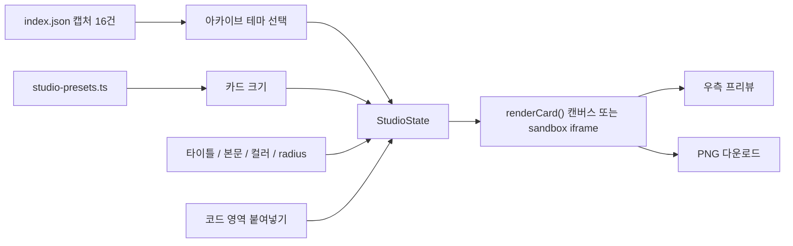

# Phase 1 — Online Marketing Studio

목표: Archive에 쌓인 16개 디자인 작업물을 테마로 골라, 인스타그램·페이스북·유튜브 커버·쇼츠 같은 **온라인 마케팅 브랜드 에셋**을 만들고 PNG로 다운로드하는 툴을 만든다.

참조 결정: `D-01`, `D-03`, `D-04`, `D-11`, `D-12`, `D-14` / 기반: [Phase 0 Archive Foundation](phase-0-foundation.md)

> 상태: **구현됨** (`src/views/studio.ts`, `src/shared/studio.ts`, `src/shared/studio-presets.ts`). 코드 영역은 HTML + CSS 조각이다.

## 범위

- 입력: 빌드된 `index.json`의 캡처 16건과 각 `capture.jpg`. Markdown은 읽지 않는다. (`D-01`)
- 출력: 선택한 SNS 규격 크기의 PNG 파일. 브라우저에서 바로 다운로드한다.
- 서버·LLM 호출 없음. 모든 합성은 브라우저 안에서 일어난다. (`D-11`)
- 생성물은 vault, `dist/`, public 번들에 저장하지 않는다. 작업 상태는 브라우저 세션 메모리에만 둔다.

## 정보 구조 변경

| 현재 | Phase 1 이후 |
|---|---|
| Archive / Intake / Design System / Stats / History | **Archive / Online Marketing Studio / History** |
| `#/intake`, `#/design-system`, `#/stats` | 세 라우트는 `#/studio`로 리다이렉트한다. 예전 북마크가 새 툴로 이어진다. |
| — | `#/studio` = Online Marketing Studio 진입점 |

- 제거 대상 UI: `src/views/intake.ts`, `src/views/design-system.ts`, `src/views/stats.ts`, `src/local-intake.ts`와 관련 CSS.
- 유지 대상: 로컬 CLI `npm run ingest`, `npm run design-system`은 UI 탭과 별개로 남긴다. 아카이브를 채우는 경로로 계속 쓴다.
- 상세 뷰에 `이 테마로 만들기` 링크를 두어 `#/studio?theme=<slug>`로 진입할 수 있게 한다.
- `decisions.md`의 `D-09`(페이지 구성)를 이 IA로 갱신한다.

## 화면 레이아웃

```text
┌──────────────────────────── AX DESIGN STUDIO ─────────────────────────────┐
│ Control panel (좌)             │ Preview (우)                            │
│ ┌ [Design] [Code] 탭 ────────┐ │                                         │
│ │ 카드 크기                   │ │      ┌──────────────────┐               │
│ │ 타이틀 / 본문 입력          │ │      │   카드 프리뷰     │               │
│ │ 아카이브 테마 (16개)        │ │      │   (실제 비율)     │               │
│ │ 카드 컬러 (컬러 피커)       │ │      └──────────────────┘               │
│ │ 카드 radius (바 + 수치)     │ │  1080 × 1080 · Instagram Feed           │
│ └────────────────────────────┘ │                     [PNG 다운로드]      │
└────────────────────────────────┴─────────────────────────────────────────┘
```

- 데스크톱(1024px 이상): 좌측 컨트롤 패널 고정 폭(약 360px, 세로 스크롤), 우측 프리뷰가 남은 영역을 채운다.
- 태블릿·모바일: 프리뷰가 위, 컨트롤 패널이 아래로 쌓인다.
- 프리뷰는 실제 출력 비율을 유지한 채 영역에 맞춰 축소해 보여 주고, 아래에 실제 픽셀 크기와 규격 이름을 표시한다.

## 컨트롤 패널

컨트롤 패널은 **디자인 영역**과 **코드 영역** 두 탭으로 나눈다. 두 영역은 같은 상태 객체(`StudioState`)를 공유한다.

### 디자인 영역

마케팅 리소스를 직접 조절하는 컨트롤이다.

| 컨트롤 | 형태 | 동작 |
|---|---|---|
| 카드 크기 | 프리셋 선택(세그먼트 또는 select) | SNS 기본 규격을 목록으로 제공하고, 진입 시 `Instagram Feed 1:1`을 자동 선택한다. 선택을 바꾸면 프리뷰 비율과 다운로드 크기가 함께 바뀐다. |
| 카드 타이틀 | 한 줄 텍스트 input | 입력 즉시 프리뷰 반영. 빈 값이면 타이틀 영역을 그리지 않는다. |
| 카드 본문 | 여러 줄 textarea | 입력 즉시 프리뷰 반영. 카드 폭을 넘으면 자동 줄바꿈한다. |
| 아카이브 테마 | 16개 썸네일 그리드(라디오 그룹) | Archive의 16개 작업물 중 하나를 고른다. 선택한 이미지를 카드 비주얼로 쓰고, 카드 비율에 맞춰 cover로 크롭한다. |
| 카드 컬러 | 컬러 피커 + hex 텍스트 입력 | `input[type=color]`와 hex 입력을 동기화한다. 카드 바탕과 텍스트 영역 색으로 쓴다. 텍스트 잉크는 대비 4.5:1을 넘는 흑/백 중 자동 선택한다. |
| 카드 radius | range 바 + number 입력 | 둘을 동기화한다. 범위 0~120px(출력 픽셀 기준), 기본 28px. 값은 CSS 변수 `--studio-card-radius`와 캔버스 렌더에 같이 적용한다. |

### 카드 크기 프리셋 (SNS 기본 베리에이션)

| id | 이름 | 크기(px) | 비율 |
|---|---|---|---|
| `ig-feed-square` | Instagram Feed (기본값) | 1080 × 1080 | 1:1 |
| `ig-feed-portrait` | Instagram Feed Portrait | 1080 × 1350 | 4:5 |
| `ig-story` | Instagram Story / Reels | 1080 × 1920 | 9:16 |
| `fb-feed` | Facebook Feed | 1200 × 630 | 1.91:1 |
| `fb-cover` | Facebook Cover | 1640 × 624 | 약 2.63:1 |
| `yt-thumbnail` | YouTube Thumbnail | 1280 × 720 | 16:9 |
| `yt-banner` | YouTube Channel Cover | 2560 × 1440 | 16:9 (안전 영역 1546 × 423 가이드 표시) |
| `yt-shorts` | YouTube Shorts | 1080 × 1920 | 9:16 |

- 프리셋은 `src/shared/studio-presets.ts` 한 곳에 데이터로 둔다. UI 목록, 프리뷰, 다운로드가 같은 배열을 쓴다.
- 플랫폼 권장 규격은 바뀔 수 있으므로 착수 시점에 한 번 더 확인하고 이 표를 갱신한다.

### 코드 영역

사람이 코드를 붙여 넣어 카드를 구성하는 영역이다.

- 붙여 넣기 textarea에 **HTML + CSS 조각**을 넣으면 프리뷰가 그 코드로 렌더된다.
- 렌더는 `sandbox` 속성을 준 `iframe`(`srcdoc`)에서만 한다. 스크립트 실행, 외부 요청, 폼 전송을 막는다.
- 코드에서 쓸 수 있는 변수를 제공한다: `--studio-color`, `--studio-radius`, `--studio-width`, `--studio-height`, 그리고 `{{title}}`, `{{body}}`, `{{themeImage}}` 치환자. 디자인 영역 값이 코드 영역에 그대로 이어진다.
- `현재 디자인을 코드로 복사` 버튼으로 디자인 영역 상태를 같은 형식의 코드로 내보낸다. 미리보기 문자열과 복사 문자열은 같은 함수가 만든다.
- 코드가 비어 있으면 디자인 영역 렌더를 그대로 쓴다.

## 프리뷰와 다운로드

- 디자인 영역 렌더는 `<canvas>`에 직접 그린다: 배경 컬러 → 테마 이미지(cover 크롭) → 라운드 클리핑 → 타이틀·본문 텍스트. 화면 프리뷰와 다운로드 PNG가 같은 렌더 함수에서 나온다.
- 다운로드 파일은 선택한 프리셋의 실제 픽셀 크기(예: 1080 × 1080)로 만든다. 파일명은 `ax-studio-<preset>-<theme-slug>.png`.
- radius가 있으면 모서리 바깥은 투명 PNG로 둔다.
- 코드 영역 렌더 다운로드는 HTML을 SVG `foreignObject`로 감싸 캔버스에 그리는 방식으로 PNG를 만든다. 테마 이미지는 data URL로 넣어 캔버스 오염을 막는다.
- 폰트는 라이선스 확인 전까지 시스템 폰트·Pretendard 폴백만 쓴다(Phase 0 확인 필요 항목).

## 상태 흐름



## 작업 계획

| 작업 | 계획 | 검증 |
|---|---|---|
| IA 정리 | 네비를 Archive / Online Marketing Studio / History로 바꾸고 `#/studio` 라우트를 추가한다. `#/intake`·`#/design-system`·`#/stats`는 `#/studio`로 리다이렉트한다. Intake·Design System·Stats 뷰와 CSS를 제거한다. | 상단 네비에 세 탭만 보인다. 예전 세 URL이 스튜디오로 열린다. `npm run audit` 통과. |
| 레이아웃 셸 | 좌측 컨트롤 패널 + 우측 프리뷰 2단 레이아웃. 모바일은 세로로 쌓는다. 선은 기존 `--line-width` 헤어라인을 쓴다. | 1440px에서 2단, 375px에서 1단. 컨트롤 패널만 스크롤되고 프리뷰는 보인다. |
| 상태 모델 | `StudioState { presetId, title, body, themeSlug, color, radius, code }`를 한 객체로 두고 모든 컨트롤이 이것만 갱신한다. URL 쿼리(`?theme=`)로 테마 초기값을 받는다. | 컨트롤을 바꿀 때마다 프리뷰가 한 번 다시 그려진다. 새로고침하면 기본값으로 돌아온다. |
| 카드 크기 프리셋 | `studio-presets.ts`에 위 8개 규격을 데이터로 둔다. 기본값 `ig-feed-square`. | 진입 시 1080 × 1080이 선택되어 있다. 프리셋을 바꾸면 프리뷰 비율과 크기 라벨이 바뀐다. |
| 텍스트 입력 | 타이틀 input, 본문 textarea. 캔버스 텍스트 줄바꿈 함수를 공유 모듈로 둔다. | 긴 본문이 카드 폭 안에서 줄바꿈된다. 빈 타이틀은 그리지 않는다. |
| 아카이브 테마 | `index.json`의 캡처 16건을 썸네일 라디오 그룹으로 보여 준다. 키보드 화살표로 이동하고 Enter/Space로 선택한다. | 16개가 모두 보이고, 선택한 이미지가 프리뷰에 반영된다. 키보드만으로 선택할 수 있다. |
| 카드 컬러 | 컬러 피커와 hex 입력을 동기화한다. 기본값은 런타임에 `--soft` 토큰을 `getComputedStyle`로 읽어 정한다. 텍스트 잉크는 대비 계산으로 흑/백을 고른다. | 소스 코드에 hex 리터럴이 늘지 않아 `check:hex`가 통과한다. 어떤 컬러를 골라도 텍스트 대비가 4.5:1 이상이다. |
| 카드 radius | range(0~120) + number 입력을 동기화하고, 범위 밖 입력은 경계값으로 맞춘다. | 바를 움직이면 숫자가, 숫자를 입력하면 바가 따라온다. 150을 입력하면 120으로 맞춰진다. |
| 캔버스 렌더 | `renderCard(state, canvas)` 하나가 프리뷰와 다운로드를 모두 그린다. 프리뷰는 같은 결과를 CSS로 축소해 보여 준다. | 다운로드 PNG의 픽셀 크기가 프리셋과 일치한다. 프리뷰와 다운로드의 구성이 같다. |
| PNG 다운로드 | `canvas.toBlob` → `a[download]`로 저장한다. radius 바깥은 투명. | 8개 프리셋 각각 다운로드 파일 크기(px)가 표와 일치한다. |
| 코드 영역 | textarea + sandbox iframe 렌더, 변수·치환자 주입, `현재 디자인을 코드로 복사`. | `<script>`를 넣어도 실행되지 않는다. 치환자가 현재 타이틀·본문·테마로 바뀐다. 복사 문자열과 미리보기 코드가 같다. |
| 코드 영역 다운로드 | SVG `foreignObject` → 캔버스 → PNG. 테마 이미지는 data URL로 넣는다. | 코드 렌더도 프리셋 크기의 PNG로 저장된다. 캔버스 오염 오류가 없다. |
| 상세 뷰 진입 링크 | 상세 뷰에 `이 테마로 만들기` 링크 추가. | 링크를 누르면 해당 slug가 테마로 선택된 스튜디오가 열린다. |
| 접근성 | 모든 컨트롤에 label, focus-visible, coarse pointer 44px 타깃. 대비 쌍을 `check:contrast`에 추가한다. | `npm run audit` 통과. 마우스 없이 크기 선택 → 텍스트 입력 → 테마 선택 → 다운로드까지 완주한다. |
| 테스트 | 프리셋 데이터, radius 클램프, 텍스트 줄바꿈, 잉크 자동 선택, 코드 치환 함수를 단위 테스트하고 `audit`에 편입한다. | 새 테스트가 `npm run audit`에서 실행되고 통과한다. |
| 문서 | README, `decisions.md`의 `D-09`, 이 문서의 상태를 구현 결과로 갱신한다. | 문서의 네비 서술이 `src/router.ts`와 일치한다. |

## 통과 기준

- 네비는 Archive / Online Marketing Studio / History 세 탭이다.
- 스튜디오 진입 시 Instagram Feed 1080 × 1080이 기본으로 선택되어 있고, 8개 SNS 규격으로 바꿀 수 있다.
- 16개 아카이브 작업물 중 하나를 테마로 골라 카드 비주얼에 쓸 수 있다.
- 타이틀·본문·컬러·radius가 즉시 프리뷰에 반영되고, radius는 바와 수치 입력이 동기화된다.
- 프리뷰는 선택한 규격의 실제 픽셀 크기 PNG로 다운로드된다.
- 코드 영역에 붙여 넣은 HTML/CSS는 sandbox 안에서만 렌더되고 스크립트는 실행되지 않는다.
- 서버, LLM 키, 외부 요청 없이 브라우저 안에서 동작하며 `npm run audit`가 통과한다.

## 확인 필요

| 항목 | 이유 | 임시 처리 |
|---|---|---|
| 코드 영역의 코드 형식 | HTML+CSS 조각을 가정했다. React/Tailwind 코드나 JSON 설정을 붙여 넣는 용도라면 렌더 방식이 달라진다. | HTML+CSS 조각으로 계획하고 착수 전에 확정한다. |
| 폰트 | 다운로드 이미지에 Samsung Sharp Sans를 쓸 수 있는지 라이선스 확인이 필요하다. | 시스템 폰트·Pretendard 폴백. |
| 테마 적용 범위 | 테마를 이미지로만 쓸지, 캡처 분석의 컬러를 카드 컬러 기본값으로도 가져올지 결정이 필요하다. | 이미지로만 쓰고 컬러는 사람이 고른다. |
| 텍스트 스타일 조절 | 폰트 크기·정렬·위치 컨트롤은 이번 요구 목록에 없다. | 프리셋별 고정 타이포 스케일로 시작한다. |
| 작업 저장 | 새로고침 후 작업을 유지할지(localStorage), 프리셋을 여러 개 한 번에 내보낼지 결정이 필요하다. | 세션 메모리만, 단일 다운로드. |
| 에셋 사용 권리 | 아카이브 이미지를 실제 마케팅에 쓸 수 있는 권리 범위 확인이 필요하다. | 툴은 합성만 하고, 사용 판단은 사람이 한다. |
